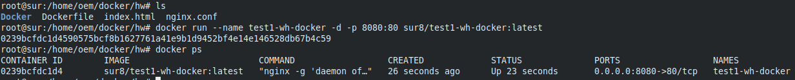
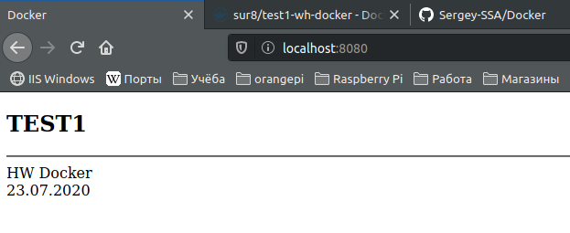

# Docker
Контейнер - это среда с функциями инкапсуляции со своей файловой системой.

Образ - подготовленное приложение со всей необходимой средой для её запуска.

Сборка ядра в контейнере возможна, но не предусмотрена технологиями Docker.

Ссылка на docker hub https://hub.docker.com/r/sur8/test1-wh-docker

Запуск контейнера из образа

Проверка работоспособности

